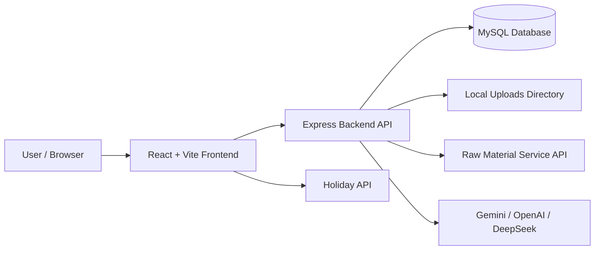
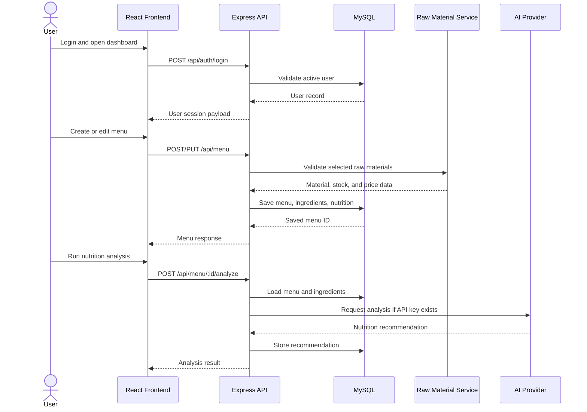
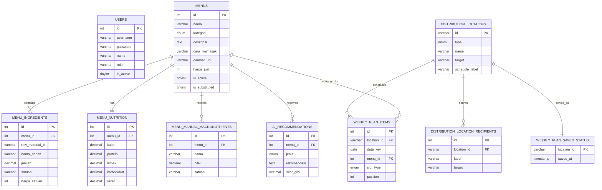

# MBGflow Menu Planning

MBGflow Menu Planning is a full-stack module for planning menu distribution and nutrition analysis for the Indonesian `Makan Bergizi Gratis` (MBG) context. The application helps nutrition staff manage menus, ingredients, nutrition values, distribution locations, weekly plans, image assets, cost snapshots, and AI-assisted nutrition recommendations.

The project is split into a React frontend and an Express backend. The backend stores menu data in MySQL, serves uploaded menu images, integrates with an external raw-material service, and can call AI providers for menu analysis or menu generation when API keys are configured.

## Features

### Authentication

- Login and logout endpoints for dashboard access.
- User data is loaded from the `users` table.
- Login currently compares plaintext credentials from the database.

### Dashboard

- Operational summary for menus, nutrition status, and weekly planning.
- Distribution-location overview for schools and Posyandu targets.
- Holiday API usage in the dashboard UI through `https://libur.deno.dev/api`.

### Menu Catalog

- List existing menus from the backend API.
- View menu image, category, nutrition summary, and metadata.
- Delete menus from the catalog page.

### Recipe Builder

- Create and edit menu records.
- Add ingredients, quantities, units, prices, and raw-material references.
- Upload menu images through Multer.
- Generate menu suggestions from available raw materials.

### Weekly Planning

- Manage weekly menu assignments per distribution location.
- Store food and drink menu slots per date.
- Save weekly-plan status per location.

### AI Nutrition Lab

- Run nutrition analysis for a selected menu.
- Store AI recommendations in the database.
- Supports provider-backed AI analysis when credentials are configured, with fallback logic in the service layer.

### Raw Material Integration

- Reads raw materials from an external raw-material service.
- Checks availability by material ID, kitchen ID, quantity, and unit.
- Stores raw-material snapshots on menu ingredients for price, unit, quality, and stock status.

### File Uploads

- Stores uploaded menu images in `backend/uploads/menu-images/`.
- Supports JPEG, PNG, WebP, and GIF.
- Limits image size to 5 MB.

## Tech Stack

| Category | Technology |
| --- | --- |
| Frontend | React 19, TypeScript, Vite |
| Styling | Tailwind CSS, custom CSS |
| UI / Animation | Framer Motion, Lucide React |
| Backend | Node.js, Express 5 |
| Database | MySQL, mysql2 |
| File Upload | Multer |
| AI Providers | Google Gemini, OpenAI, DeepSeek |
| External Service | Raw Material Service API |
| Package Manager | npm |
| Tooling | ESLint, TypeScript |

## System Architecture



## Main Workflow



## Folder Structure

```text
menu-planning/
├── backend/
│   ├── middleware/
│   │   └── upload.js
│   ├── routes/
│   │   ├── auth.js
│   │   └── menu.js
│   ├── services/
│   │   ├── aiNutritionService.js
│   │   ├── ingredientMapper.js
│   │   └── rawMaterialApiClient.js
│   ├── uploads/
│   │   └── menu-images/
│   ├── db.js
│   ├── server.js
│   ├── setup-db.js
│   └── package.json
├── frontend/
│   ├── src/
│   │   ├── assets/
│   │   ├── components/
│   │   ├── pages/
│   │   ├── utils/
│   │   ├── App.tsx
│   │   └── main.tsx
│   ├── vite.config.ts
│   └── package.json
├── docs/
├── ANALISIS_TEST_CASE_MENU_PLANNING.md
├── schema.sql
└── README.md
```

| Path | Purpose |
| --- | --- |
| `backend/server.js` | Express application entry point. |
| `backend/db.js` | MySQL connection pool configuration. |
| `backend/routes/auth.js` | Login and logout API routes. |
| `backend/routes/menu.js` | Menu, weekly plan, raw material, AI analysis, image, and stats API routes. |
| `backend/services/aiNutritionService.js` | Nutrition standards, AI provider integration, analysis, and fallback logic. |
| `backend/services/rawMaterialApiClient.js` | Client for the external raw-material service. |
| `backend/middleware/upload.js` | Multer storage, file type validation, and upload limits. |
| `frontend/src/pages/` | Main application pages. |
| `frontend/src/components/` | Reusable UI and feature components. |
| `schema.sql` | MySQL schema, seed data, and migration-style alterations. |

## Installation

### Prerequisites

- Node.js 18 or newer.
- npm.
- MySQL server.
- Optional API keys for Gemini, OpenAI, or DeepSeek.
- Optional running raw-material service at `http://localhost:5000`.

### 1. Clone Repository

```bash
git clone <repository-url>
cd MBGflow/menu-planning
```

### 2. Configure Backend Environment

No `.env.example` file was found in this module. Create `backend/.env` manually:

```env
PORT=3002
DB_HOST=localhost
DB_USER=root
DB_PASSWORD=
DB_NAME=maneki_scm

RAW_MATERIAL_SERVICE_BASE_URL=http://localhost:5000
RAW_MATERIAL_SERVICE_TOKEN=
RAW_MATERIAL_SERVICE_TIMEOUT_MS=3000

GEMINI_API_KEY=
OPENAI_API_KEY=
OPENAI_MODEL=gpt-5.2
DEEPSEEK_API_KEY=
DEEPSEEK_MODEL=deepseek-chat
```

### 3. Install Backend Dependencies

```bash
cd backend
npm install
npm run setup-db
npm run dev
```

The backend runs on `http://localhost:3002` by default.

### 4. Install Frontend Dependencies

Open a second terminal:

```bash
cd frontend
npm install
npm run dev
```

The Vite dev server usually runs on `http://localhost:5173`.

## Environment Variables

| Variable | Required | Default | Description |
| --- | --- | --- | --- |
| `PORT` | No | `3002` | Backend server port. |
| `DB_HOST` | No | `localhost` | MySQL host. |
| `DB_USER` | No | `root` | MySQL username. |
| `DB_PASSWORD` | No | empty | MySQL password. |
| `DB_NAME` | No | `maneki_scm` | MySQL database name used by the backend pool. |
| `RAW_MATERIAL_SERVICE_BASE_URL` | No | `http://localhost:5000` | External raw-material service base URL. |
| `RAW_MATERIAL_SERVICE_TOKEN` | No | empty | Bearer token for the raw-material service. |
| `RAW_MATERIAL_SERVICE_TIMEOUT_MS` | No | `3000` | Raw-material request timeout in milliseconds. |
| `GEMINI_API_KEY` | No | empty | Google Gemini API key for AI nutrition features. |
| `OPENAI_API_KEY` | No | empty | OpenAI API key for AI nutrition features. |
| `OPENAI_MODEL` | No | `gpt-5.2` | OpenAI model name used by the service. |
| `DEEPSEEK_API_KEY` | No | empty | DeepSeek API key for AI nutrition features. |
| `DEEPSEEK_MODEL` | No | `deepseek-chat` | DeepSeek model name used by the service. |

## API Documentation

Base URL: `http://localhost:3002`

### Healthcheck

| Method | Endpoint | Description |
| --- | --- | --- |
| `GET` | `/health` | Returns backend health status. |

### Authentication

| Method | Endpoint | Description |
| --- | --- | --- |
| `POST` | `/api/auth/login` | Validates username and password from the `users` table. |
| `POST` | `/api/auth/logout` | Returns logout success response. |

### Menu API

| Method | Endpoint | Description |
| --- | --- | --- |
| `GET` | `/api/menu` | Lists menus. |
| `POST` | `/api/menu` | Creates a menu with ingredients and nutrition data. |
| `GET` | `/api/menu/:id` | Gets menu detail by ID. |
| `PUT` | `/api/menu/:id` | Updates menu detail, ingredients, and nutrition data. |
| `DELETE` | `/api/menu/:id` | Deletes a menu. |
| `GET` | `/api/menu/:id/ingredients` | Lists ingredients for a menu. |
| `GET` | `/api/menu/:id/hpp` | Calculates menu cost / HPP. |
| `POST` | `/api/menu/:id/upload-image` | Uploads an image for a menu using form field `image`. |
| `DELETE` | `/api/menu/:id/image` | Removes a menu image reference/file. |

### Nutrition and AI

| Method | Endpoint | Description |
| --- | --- | --- |
| `POST` | `/api/menu/analyze-plate` | Analyzes a combined plate/menu selection. |
| `POST` | `/api/menu/:id/analyze` | Runs AI nutrition analysis for a menu. |
| `GET` | `/api/menu/:id/recommendations` | Lists AI recommendations for a menu. |
| `POST` | `/api/menu/ai-generate` | Generates a menu suggestion from available ingredients. |

### Planning and Distribution

| Method | Endpoint | Description |
| --- | --- | --- |
| `GET` | `/api/menu/distribution-locations` | Lists distribution locations. |
| `POST` | `/api/menu/distribution-locations` | Creates a distribution location. |
| `GET` | `/api/menu/weekly-plans` | Loads weekly menu plans. |
| `PUT` | `/api/menu/weekly-plans` | Saves weekly menu plans. |

### Integration and Statistics

| Method | Endpoint | Description |
| --- | --- | --- |
| `GET` | `/api/menu/raw-materials` | Proxies active raw-material data from the external service. |
| `GET` | `/api/menu/integration/list` | Returns menu integration data. |
| `GET` | `/api/menu/stats/summary` | Returns dashboard summary statistics. |

## Data Model

The database schema is defined in `schema.sql`.



## Screenshots

No dedicated screenshot documentation folder was found.

```md
<!-- Add application screenshots here. Example: -->
<!--  -->
```

## Usage

1. Start MySQL.
2. Run `npm run setup-db` from `backend/` to create schema and seed initial data.
3. Start the backend with `npm run dev`.
4. Start the frontend with `npm run dev` from `frontend/`.
5. Login with an active user from the `users` table.
6. Open the dashboard to review menu and planning status.
7. Use Menu Catalog to browse or delete menus.
8. Use Recipe Builder to create or update recipes, add ingredients, and upload images.
9. Use Weekly Schedule to assign menus to distribution locations.
10. Use AI Nutrition Lab to analyze nutrition when an AI provider key is configured.

## Testing

### Backend

```bash
cd backend
npm run test:models
```

The backend contains a model-detection script for configured AI providers. No general automated backend test suite was found.

### Frontend

No frontend test script was found. The available validation command is:

```bash
cd frontend
npm run lint
```

## Build and Production

### Frontend Build

```bash
cd frontend
npm run build
npm run preview
```

### Backend Start

```bash
cd backend
npm start
```

Production deployment instructions, process manager configuration, Dockerfile, and CI/CD workflow were not found in this module.

## Contribution

1. Fork the repository.
2. Create a feature branch.
3. Make focused changes.
4. Run relevant checks.
5. Commit with a clear message.
6. Push the branch.
7. Open a pull request.

## License

The backend `package.json` declares `ISC`, but no root `LICENSE` file was found in `menu-planning/`. Add a license file if this repository will be distributed publicly.

## Notes and Limitations

- No `.env.example` file was found; environment variables were inferred from code.
- Frontend API URLs are hardcoded to `http://localhost:3002` in multiple files instead of using Vite environment variables.
- Authentication currently compares plaintext passwords and returns a base64 token-like value; this is suitable only for development/demo use.
- `backend/setup-db.js` always creates and uses the `maneki_scm` database, while `DB_NAME` is used by `backend/db.js` for runtime connections.
- AI features depend on optional provider API keys. Without keys, parts of the service use fallback behavior.
- Raw-material availability and price accuracy depend on the external raw-material service being available and compatible with the expected API shape.
- Uploaded files are stored locally under `backend/uploads/`, so production deployments need persistent storage configuration.
- Automated tests are limited; no complete unit/integration test suite was found.
